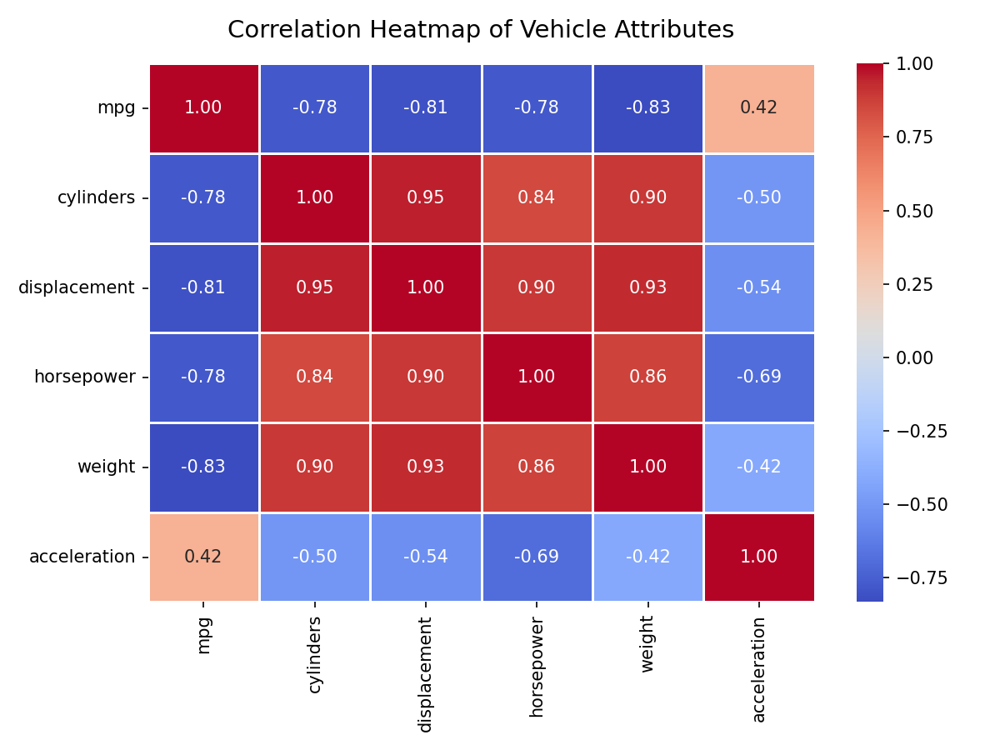
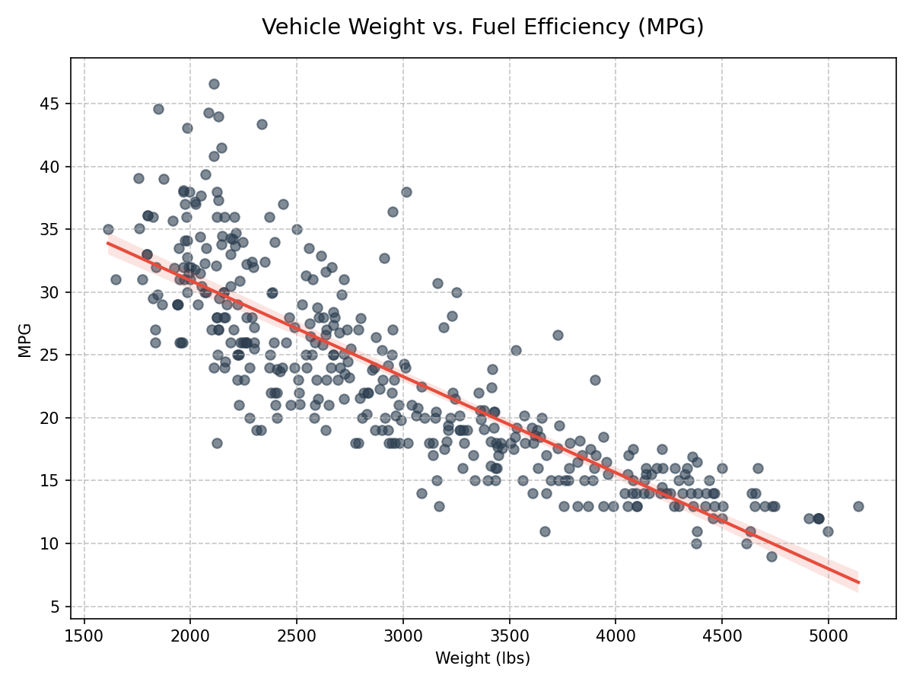
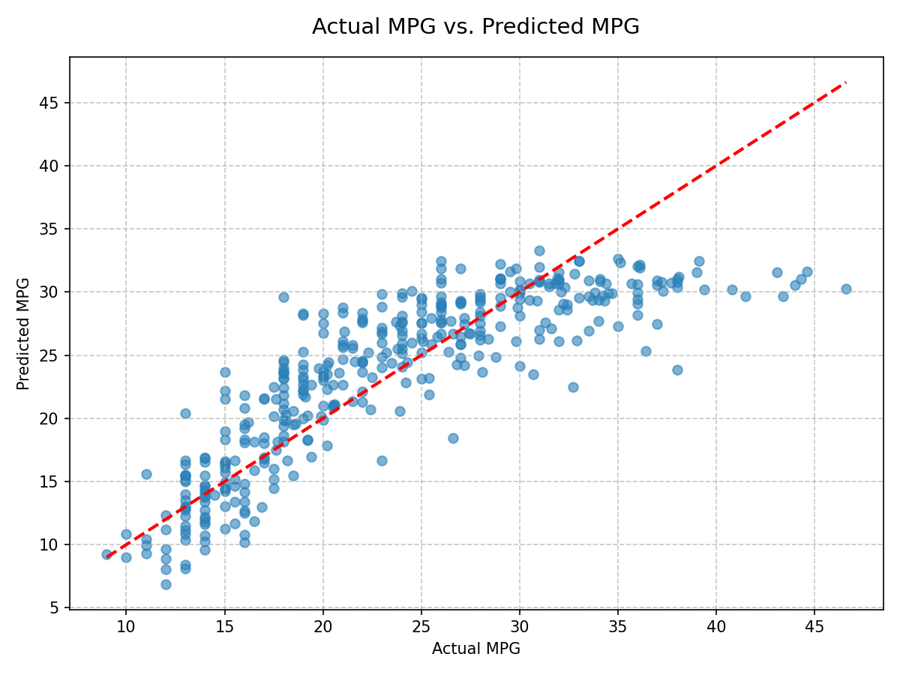
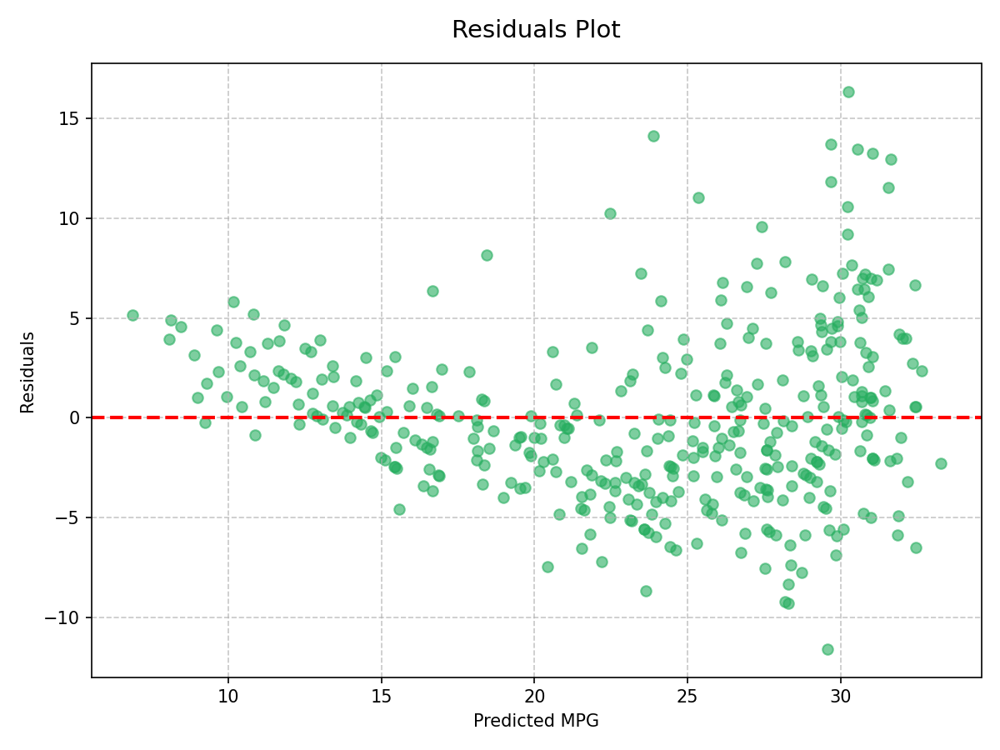

# Multiple Linear Regression for Fuel Efficiency Analysis (Auto MPG)

[English](#english) | [Bahasa Indonesia](#bahasa-indonesia)

---

<a name="english"></a>
## 🇬🇧 English Version

### 📌 Executive Summary (30-Second Read)
* **Objective**: Developed a Multiple Linear Regression model with forward stepwise selection to analyze the physical and mechanical factors affecting vehicle fuel efficiency (measured in Miles Per Gallon / **MPG**).
* **Key Findings**:
  - **Selected Predictors**: Stepwise forward selection (using F-test significance) identified 5 critical variables: **weight**, **horsepower**, **cylinders**, **acceleration**, and **displacement**.
  - **Model Fit**: The final regression model explains **70.77%** of the variance in MPG ($R^2$ = 0.7077, Adjusted $R^2$ = 0.7039) with a highly significant overall fit (F-statistic = 186.91).
  - **Regression Equation**:
    $$\text{MPG} = 46.2643 - 0.0052(\text{weight}) - 0.0453(\text{horsepower}) - 0.3979(\text{cylinders}) - 0.0291(\text{acceleration}) - 0.0001(\text{displacement})$$
  - **Negative Drivers**: All variables negatively affect MPG. Standardized coefficients reveal that **weight** has the strongest negative impact (**-0.5645**), followed by **horsepower** (**-0.2232**).
* **Actionable Recommendations**:
  - **Prioritize Lightweight Materials**: Since vehicle weight has the strongest negative impact on MPG (standardized coefficient of -0.5645), automotive engineers should prioritize lightweight materials (e.g., aluminum, carbon fiber) to boost fuel efficiency.
  - **Optimize Engine Configuration**: Restructuring engine horsepower and cylinder count can yield significant savings. Because horsepower has the second strongest negative impact (-0.2232), using smaller turbocharged engines or hybrid drivetrains can maintain performance without sacrificing MPG.
  - **Perform Pre-Prototype Simulations**: Use the regression formula as a mathematical model to simulate the trade-off between vehicle performance (acceleration and horsepower) and fuel economy prior to physical manufacturing.

---

### 📊 Key Insights & Visualizations

#### 1. Correlation Heatmap
MPG shows a strong negative linear correlation with vehicle weight (**-0.83**), displacement (**-0.81**), and horsepower (**-0.78**), indicating that heavier and more powerful vehicles consume significantly more fuel.


#### 2. Vehicle Weight vs. Fuel Efficiency (MPG)
The scatter plot with the fitted regression line highlights the steep decline in fuel efficiency as vehicle weight increases.


#### 3. Actual vs. Predicted MPG
The regression model displays strong predictive alignment with actual values, clustering closely along the ideal $y=x$ reference line.


#### 4. Residuals Plot
The residuals are evenly distributed around the horizontal line of zero, confirming that the regression assumptions (homoscedasticity) hold well across the predicted range.


---

<a name="bahasa-indonesia"></a>
## 🇮🇩 Versi Bahasa Indonesia

### 📌 Ringkasan Eksekutif (30 Detik Baca)
* **Tujuan**: Membangun model Regresi Linear Berganda dengan metode *Forward Stepwise Selection* untuk menganalisis faktor fisik dan mekanis yang memengaruhi efisiensi konsumsi bahan bakar mobil (diukur dalam Mil Per Galon / **MPG**).
* **Temuan Utama**:
  - **Prediktor Terpilih**: Seleksi maju bertahap berbasis signifikansi Uji-F memilih 5 variabel utama: **weight** (bobot), **horsepower** (tenaga kuda), **cylinders** (silinder), **acceleration** (akselerasi), dan **displacement** (kapasitas mesin).
  - **Kesesuaian Model**: Model regresi akhir mampu menjelaskan **70,77%** variabilitas MPG ($R^2$ = 0,7077, Adjusted $R^2$ = 0,7039) dengan signifikansi model keseluruhan yang sangat tinggi (F-statistic = 186,91).
  - **Persamaan Regresi**:
    $$\text{MPG} = 46,2643 - 0,0052(\text{weight}) - 0,0453(\text{horsepower}) - 0,3979(\text{cylinders}) - 0,0291(\text{acceleration}) - 0,0001(\text{displacement})$$
  - **Faktor Penurun Efisiensi**: Semua variabel berpengaruh negatif terhadap MPG. Koefisien standar menunjukkan bahwa **weight** memiliki dampak negatif terbesar (**-0,5645**), diikuti oleh **horsepower** (**-0,2232**).
* **Rekomendasi Rekayasa**:
  - **Prioritaskan Pengurangan Bobot**: Karena bobot kendaraan memiliki dampak negatif terkuat terhadap efisiensi bahan bakar (koefisien standar -0,5645), fokus utama desain kendaraan harus diarahkan pada material ringan (seperti aluminium atau serat karbon).
  - **Optimasi Konfigurasi Mesin**: Lakukan restrukturisasi daya mesin. Karena *horsepower* memiliki dampak negatif terkuat kedua (-0,2232), penggunaan mesin turbo berkapasitas lebih kecil atau sistem hibrida dapat menjaga performa tanpa menurunkan efisiensi.
  - **Simulasi Pra-Prototipe**: Gunakan formula persamaan regresi sebagai model simulasi matematika untuk menguji trade-off antara spesifikasi performa (akselerasi/tenaga) dan konsumsi bahan bakar sebelum masuk ke tahap produksi fisik.

---

### 📊 Wawasan Utama & Visualisasi

#### 1. Heatmap Korelasi
Variabel MPG memiliki korelasi negatif yang kuat dengan bobot kendaraan (**-0,83**), kapasitas mesin (**-0,81**), dan tenaga kuda (**-0,78**).


#### 2. Hubungan Bobot Kendaraan vs. Efisiensi (MPG)
Grafik sebar dengan garis regresi memperlihatkan penurunan tajam nilai MPG seiring bertambahnya bobot kendaraan.


#### 3. Nilai Aktual vs. Prediksi MPG
Model regresi menunjukkan kesesuaian prediksi yang sangat baik, dengan titik data yang tersebar merapat di sepanjang garis referensi ideal $y=x$.


#### 4. Grafik Residual (Residuals Plot)
Penyebaran residual yang merata di sekitar garis nol menunjukkan bahwa asumsi regresi (homoskedastisitas) terpenuhi dengan baik.


---

## 📂 Struktur Berkas
*   📄 `Auto_MPG.xlsx` - Dataset spesifikasi kendaraan dan nilai efisiensi (MPG).
*   📄 `TE000322.pdf` - Dokumen penjelasan laporan tugas.
*   📓 `main.ipynb` - Jupyter Notebook berisi implementasi lengkap analisis korelasi, permodelan regresi, dan uji statistik.
*   📂 `images/` - Folder penyimpanan visualisasi grafik hasil ekspor.

---

## ⚙️ Persyaratan Sistem & Instalasi
Instal pustaka Python yang diperlukan:
```bash
pip install numpy pandas matplotlib seaborn openpyxl
```
Jalankan Jupyter Notebook:
```bash
jupyter notebook main.ipynb
```
